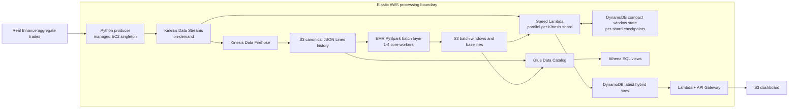

# Cryptocurrency Market Analytics

A Python, Apache Spark, and AWS Lambda-architecture project that identifies:

> Which configured USDT spot markets are trending or showing statistically abnormal price movement during the latest five-minute window, relative to their complete historical behaviour?

The production pipeline uses real Binance aggregate trades. Synthetic events are used only for repeatable load and worker-count experiments.

## Why Lambda architecture

Neither processing path answers the complete question alone:

- The batch layer recomputes accurate per-symbol return, volume, and trade-count distributions from the full S3 history.
- The speed layer maintains a low-latency, event-time sliding window while data is arriving.
- The hybrid serving view combines recent measurements with batch-generated means, standard deviations, sample counts, and baseline timestamps. This provides freshness without losing historical context.

## Architecture



The batch and speed paths execute independently and concurrently:

- **Data parallelism:** Spark partitions the full event history across EMR executors.
- **Task parallelism:** Lambda invokes one ordered processor per Kinesis shard; separate shards run concurrently.
- **Hybrid parallelism:** batch and speed jobs run as separate tasks, and each fresh result is fused with its historical baseline before serving.

## Data sources

| Purpose | Source | Classification |
|---|---|---|
| Live pipeline and demonstration | Binance public `aggTrade` WebSocket | Real |
| Historical backfill | Binance Vision daily `aggTrades` archives | Real |
| Local correctness fixture | `sample_data/events/market-events.jsonl` | Small test fixture |
| Controlled performance experiments | `crypto_analytics.synthetic` | Synthetic and explicitly labelled |

The assignment requires lecturer approval for a self-proposed dataset. Obtain and mention that approval in the report.

## Processing details

### Ingestion

`crypto_analytics.binance` connects to aggregate-trade streams for the symbols in `MARKET_SYMBOLS`. Each record contains an exact price, quote volume, trade count, event timestamp, ingestion timestamp, and trade ID. Kinesis records end with a newline so Firehose produces Spark-readable JSON Lines objects.

### Batch layer

`crypto_analytics.pyspark_batch` reads the same schema archived by Firehose. It produces:

- complete event-time-aligned five-minute windows;
- return, quote-volume, and trade-count aggregates;
- full-history per-symbol means, standard deviations, medians, and sample counts;
- Parquet batch views and JSON baselines for the speed layer.

### Speed layer

`crypto_analytics.speed_lambda` processes Kinesis shards concurrently. It:

- aggregates exact trades into compact one-second buckets;
- keeps only the most recent five minutes;
- checkpoints the last sequence number for each shard;
- uses conditional DynamoDB writes for concurrent-update safety;
- ignores retried records already covered by a checkpoint;
- merges the live window with the latest batch baseline;
- writes one current hybrid result per symbol.

The local `crypto_analytics.consumer` remains available as a single-process fallback.

### Athena SQL layer

AWS Glue catalogs both real-data representations:

- `raw_market_events` reads the compressed JSON event archive under `raw/`;
- `batch_windows` reads the symbol-partitioned Parquet produced by EMR.

The `crypto-analytics-athena` workgroup stores query results under
`s3://<raw-bucket>/athena-results/` and publishes query metrics to CloudWatch.
Versioned SQL under `sql/athena/` creates these reusable views:

- `latest_market_prices`;
- `trending_coins`;
- `abnormal_price_spikes`;
- `market_summary`.

## Local setup

```bash
python3 -m venv .venv
source .venv/bin/activate
python -m pip install -r requirements-dev.txt
python -m unittest discover -s tests -v
```

Run the local batch view over the included fixture:

```bash
python -m crypto_analytics.batch \
  --input sample_data/events \
  --output data/baselines/baselines.json
```

Collect a small live real-data file without AWS:

```bash
python -m crypto_analytics.binance \
  --symbols BTCUSDT,ETHUSDT,SOLUSDT \
  --output-jsonl data/raw/live-events.jsonl \
  --max-records 10000
```

Run the local speed fallback:

```bash
python -m crypto_analytics.speed \
  --input-jsonl data/raw/live-events.jsonl \
  --baseline-json data/baselines/baselines.json \
  --output-json data/serving/latest.json
```

## Real historical backfill

Download real aggregate trades from Binance Vision. Start with a short date range because active symbols can produce large files:

```bash
python -m crypto_analytics.historical \
  --symbols BTCUSDT,ETHUSDT,SOLUSDT \
  --start 2026-07-01 \
  --end 2026-07-02 \
  --output-dir data/raw/binance-vision
```

These files use exactly the same canonical schema as the live stream.

## AWS Learner Lab deployment

Set the Learner Lab region and stack name:

```bash
export AWS_REGION=us-east-1
export STACK_NAME=crypto-analytics
```

In AWS Academy Learner Lab, use the provided role/profile rather than creating IAM roles:

```bash
export LAB_ROLE_ARN="arn:aws:iam::<account-id>:role/LabRole"
export LAB_INSTANCE_PROFILE_ARN="arn:aws:iam::<account-id>:instance-profile/LabInstanceProfile"
```

1. Deploy storage, Kinesis, DynamoDB, the API, and dashboard resources:

   ```bash
   ./scripts/deploy_stack.sh
   ```

2. Upload the application package to the new raw bucket:

   ```bash
   ./scripts/package_and_upload.sh
   ```

3. Upload a real historical backfill under the raw prefix:

   ```bash
   RAW_BUCKET="$(aws cloudformation describe-stacks \
     --stack-name "$STACK_NAME" \
     --query "Stacks[0].Outputs[?OutputKey=='RawBucketName'].OutputValue | [0]" \
     --output text)"
   aws s3 sync data/raw/binance-vision "s3://$RAW_BUCKET/raw/backfill/"
   ```

4. Create the EMR cluster and run the full-history Spark job:

   ```bash
   export SUBNET_ID=subnet-xxxxxxxx
   export LOG_BUCKET="$RAW_BUCKET"
   export CLUSTER_ID="$(./scripts/create_emr_cluster.sh)"

   aws s3 cp crypto_analytics/pyspark_batch.py \
     "s3://$RAW_BUCKET/artifacts/pyspark_batch.py"

   export CODE_S3_PATH="s3://$RAW_BUCKET/artifacts/pyspark_batch.py"
   export INPUT_PATH="s3://$RAW_BUCKET/raw/"
   export OUTPUT_PATH="s3://$RAW_BUCKET/baselines/parquet/"
   export JSON_OUTPUT_PATH="s3://$RAW_BUCKET/baselines/latest/"
   export BATCH_VIEW_OUTPUT_PATH="s3://$RAW_BUCKET/batch-windows/"
   ./scripts/submit_batch_step.sh
   ```

5. After the baseline step completes, enable the real producer and distributed speed Lambda:

   ```bash
   export REALTIME_SUBNET_ID="$SUBNET_ID"
   export SPEED_LAMBDA_CODE_KEY=artifacts/crypto-analytics.zip
   ./scripts/deploy_stack.sh
   ```

6. Create or refresh the Athena SQL views:

   ```bash
   ./scripts/setup_athena.sh
   ```

   Run an example query:

   ```bash
   aws athena start-query-execution \
     --work-group crypto-analytics-athena \
     --query-execution-context Database=crypto_analytics \
     --query-string "SELECT * FROM trending_coins ORDER BY trend_rank"
   ```

7. Deploy the static dashboard:

   ```bash
   ./scripts/deploy_frontend.sh
   ```

AWS Academy accounts sometimes use a pre-created `LabRole` instead of EMR default roles. Override `EMR_SERVICE_ROLE`, `EMR_EC2_PROFILE`, and `EMR_AUTOSCALING_ROLE` before creating the cluster when required by the lab.

## Explicit auto-scaling policy

The EMR core group uses [scripts/emr-auto-scaling-policy.json](scripts/emr-auto-scaling-policy.json):

| Action | Trigger | Evaluation | Adjustment | Cooldown |
|---|---|---|---|---|
| Scale out | YARN available memory below 20% | Two consecutive 60-second periods | Add one core worker | 120 seconds |
| Scale in | YARN available memory above 75% | Five consecutive 60-second periods | Remove one core worker | 300 seconds |

Capacity is constrained to 1-4 core workers. Kinesis uses on-demand mode, and the speed Lambda scales concurrently with the number of open Kinesis shards.

## Performance experiments

Generate explicitly labelled local smoke-test evidence:

```bash
python -m crypto_analytics.benchmark \
  --synthetic-events 200000 \
  --synthetic-symbols 32 \
  --workers 1,2,4 \
  --repeats 5

python -m crypto_analytics.load_benchmark \
  --rates 100,500,1000 \
  --duration-seconds 10

python -m crypto_analytics.plot_metrics
```

The real AWS experiment matrix has now been completed. The auto-scaling policy
was detached during fixed-worker comparisons, the same core group was resized
to 1, 2, and 4 workers, and each configuration was repeated three times. The
policy was then reattached for a separate scale-out/scale-in stress run.
Controlled Kinesis loads captured p50/p95/p99 latency, achieved throughput,
iterator age, Lambda duration, errors, and throttles.

Real AWS calculations, raw CSV files, limitations, and report-ready graphs are
described in [results/aws/README.md](results/aws/README.md). The earlier local
synthetic smoke tests remain documented separately in
[results/README.md](results/README.md). The submission checklist is in
[docs/H1_EVIDENCE.md](docs/H1_EVIDENCE.md).
